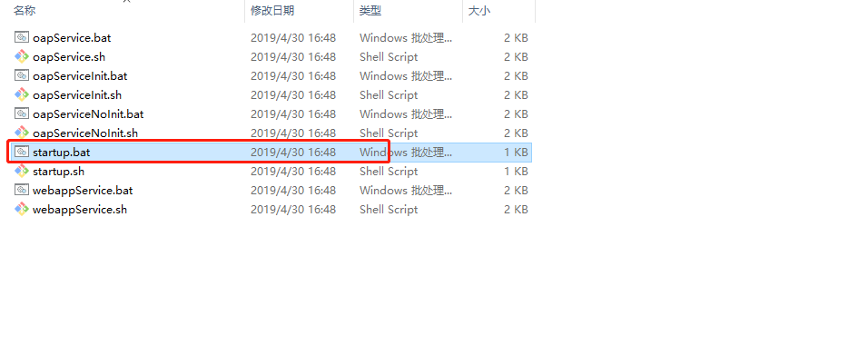
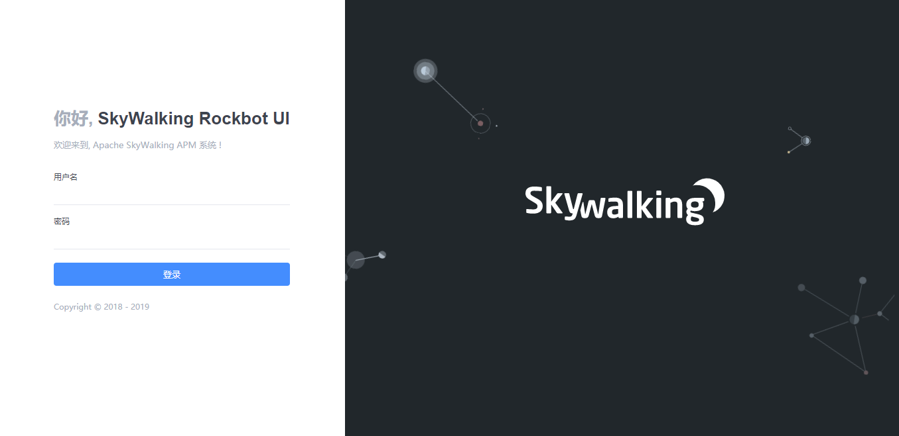
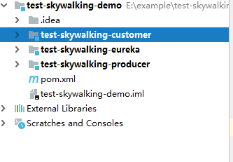
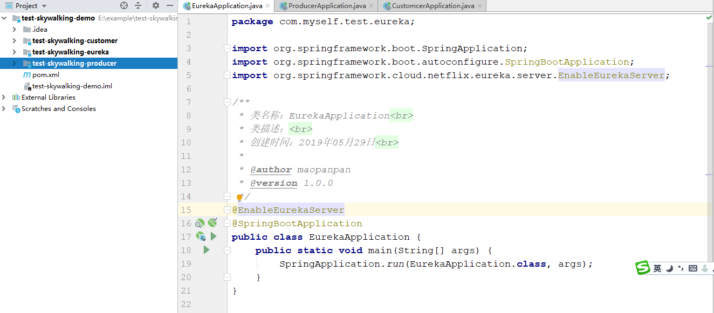
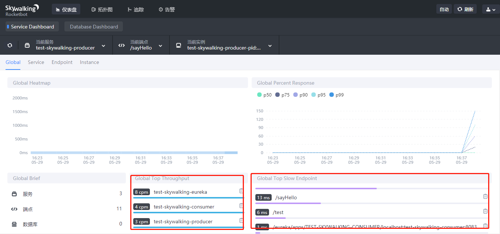
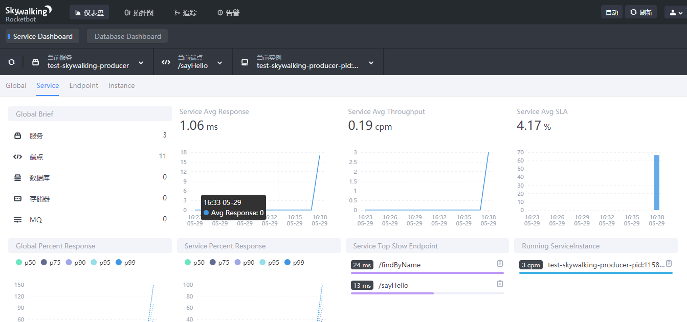
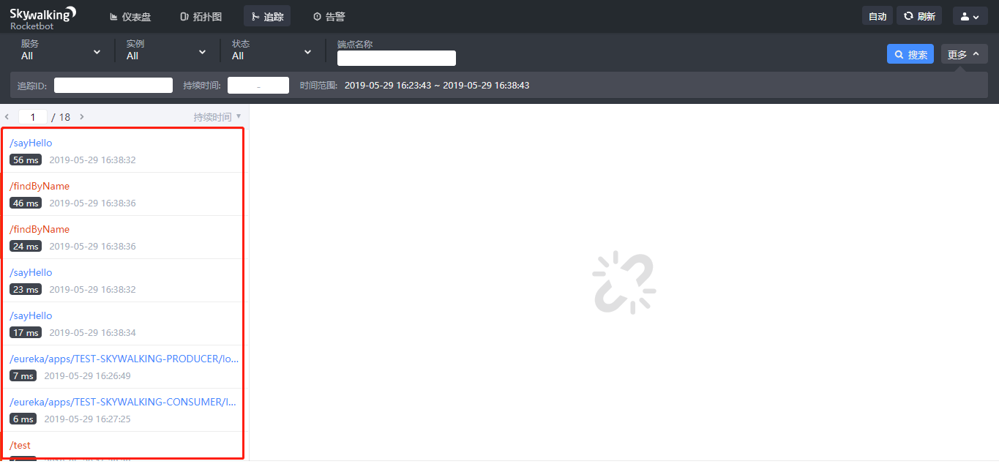

## Spring cloud + SkyWalking链路追踪

### SkyWalking环境搭建

#### SkyWalking下载

[SkyWalking]([**http://mirrors.tuna.tsinghua.edu.cn/apache/skywalking/6.1.0/apache-skywalking-apm-6.1.0.tar.gz**](http://mirrors.tuna.tsinghua.edu.cn/apache/skywalking/6.1.0/apache-skywalking-apm-6.1.0.tar.gz))

#### SkyWalking安装

- 解压下载安装包

  

  

- 进入bin目录，双击 startup.bat

  

- 服务启动，浏览器访问 http://localhost:8080进入SkyWalking监控页面。登录用户默认为：

  userName: admin

  password: admin

  

  

  

图上，有三个服务，分别为：



[demo](https://github.com/maopanpan/test-skywalking-demo.git)


### SkyWalking使用

#### SkyWalking手动追踪API

- 添加依赖maven

  ```` 
     <dependency>
        <groupId>org.apache.skywalking</groupId>
        <artifactId>apm-toolkit-trace</artifactId>
        <version>${skywalking.version}</version>
     </dependency>
  ````

- 示例代码，仅供参考

  import org.apache.skywalking.apm.toolkit.trace.Trace;

  对任何需要追踪的方法，使用 @Trace 标注，则此方法会被加入到追踪链中。

  在被追踪的方法中自定义 tag.

  ActiveSpan.tag("my_tag", "my_value");

  ```
   /**
       * 对任何需要追踪的方法，使用 @Trace 标注，则此方法会被加入到追踪链中。
       * 在被追踪的方法中自定义 tag.
       */
      @RequestMapping("/login")
      @Trace
      public String login(@RequestParam("userName") String userName, @RequestParam("passwrod") String passwrod){
          logger.info("login to system1, user: " + userName);
          //TraceContext.traceId() API，在应用程序的任何地方获取traceId.
          ActiveSpan.tag("login_tag", "login to system, user: " + userName);
          return userService.login(userName,passwrod);
      }
  ```

  

#### 日志组件追踪

- 添加Maven依赖

  ```
   <dependency>
      <groupId>org.apache.skywalking</groupId>
      <artifactId>apm-toolkit-logback-1.x</artifactId>
   </dependency>
  ```

- 在logback.xml中添加追踪ID

  ```
  <appender name="FILE" class="ch.qos.logback.core.rolling.RollingFileAppender">
          <file>${LOG_HOME}/${APP_NAME}/skywalking-customer.log</file>
          <rollingPolicy class="ch.qos.logback.core.rolling.SizeAndTimeBasedRollingPolicy">
              <!-- rollover daily -->
              <fileNamePattern>${LOG_HOME}/${APP_NAME}/%d{yyyy-MM-dd}/gateway-%d{yyyy-MM-dd}.%i.log</fileNamePattern>
              <!-- each file should be at most 100MB, keep 60 days worth of history, but at most 20GB -->
              <maxFileSize>500MB</maxFileSize>
              <maxHistory>100</maxHistory>
          </rollingPolicy>
          <encoder>
              <layout class="org.apache.skywalking.apm.toolkit.log.logback.v1.x.TraceIdPatternLogbackLayout">
                  <Pattern>%d{yyyy-MM-dd HH:mm:ss.SSS} [%tid] [%thread] %-5level %logger{36} -%msg%n</Pattern>
              </layout>
          </encoder>
      </appender>
  ```

  

#### 使用示例

如图：



- 创建一个名称为test-skywalking-demo Spring Cloud项目
- 注册中心 test-skywalking-eureka
- 服务端 test-skywalking-producer
- 服务调用方 test-skywalking-customer
- 分别启动 test-skywalking-eureka、test-skywalking-producer、test-skywalking-customer

####SkyWalking效果展示








